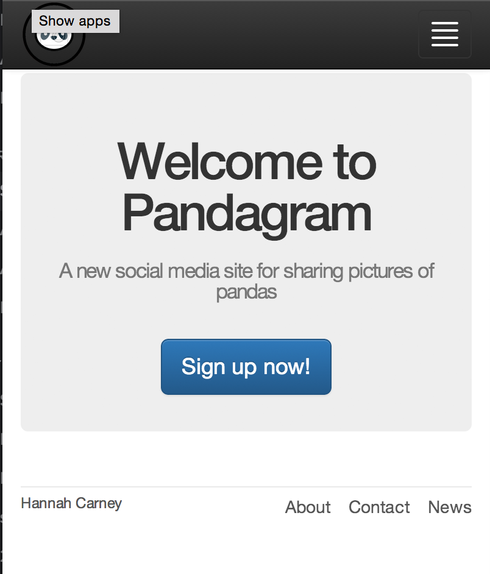
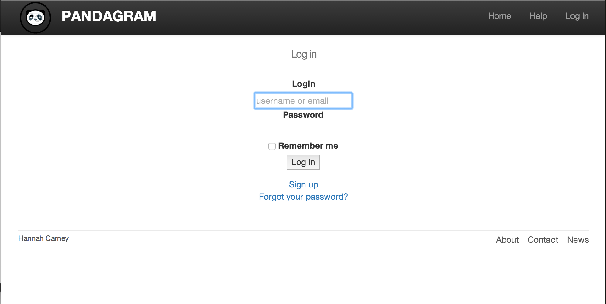

# Pandagram

Week 9 Challenge. Make a clone of Instagram on your own.

Heroku (live)
-----
[pandagram](https://pandagram.herokuapp.com/)

Screenshot
----
<div align="center">
    
</div>
<p></p>
<div align="center">
   
</div>

Technologies used
-----
- Ruby
- Rails
- RSpec
- JQuery
- postgreSQL
- HTML
- CSS

Objectives of exercise
----- 
- Rails
 * Test-Driven-Development
- Spent most time trying to make a responsive design
- Also many hours figuring out how to log in using email or username

To Do
-----
- [ ] Users can add photos
- [ ] Users can like photos

Set up postgreSQL
-----
[install postgreSQL](http://www.postgresql.org/download/)

```sh
psql
\l
CREATE DATABASE pandagram_development ;
CREATE DATABASE pandagram_test ;
\q
```

How to run test
-----
```sh
bundle install
bin/rake db:migrate RAILS_ENV=test
rspec
```

How to run locally
-----
Open browser to http://localhost:9292/

```sh
bundle install
bin/rake db:migrate RAILS_ENV=development
rackup
```
I am [Hannah] from the December 2014 cohort of Makers Academy, London!
[Hannah]:https://github.com/HannahCarney
